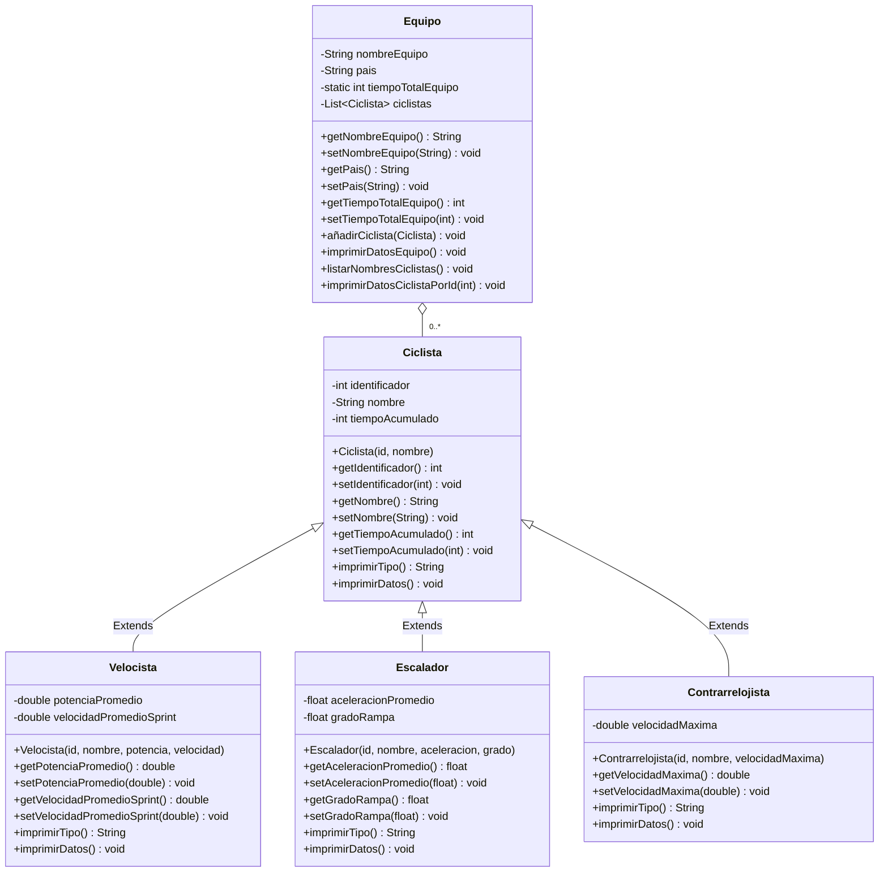

# ejercicio-ciclista

# Integrantes 
### William Villa
### Alejandro Ibarra
### Juan Pablo Rubiano
---
## Diagrama de clase Ciclista

```mermaid
classDiagram
    class Equipo {
        -String nombreEquipo
        -String pais
        -static int tiempoTotalEquipo
        -List~Ciclista~ ciclistas
        +getNombreEquipo() String
        +setNombreEquipo(String) void
        +getPais() String
        +setPais(String) void
        +getTiempoTotalEquipo() int
        +setTiempoTotalEquipo(int) void
        +añadirCiclista(Ciclista) void
        +imprimirDatosEquipo() void
        +listarNombresCiclistas() void
        +imprimirDatosCiclistaPorId(int) void
    }

    class Ciclista {
        -int identificador
        -String nombre
        -int tiempoAcumulado
        +Ciclista(id, nombre)
        +getIdentificador() int
        +setIdentificador(int) void
        +getNombre() String
        +setNombre(String) void
        +getTiempoAcumulado() int
        +setTiempoAcumulado(int) void
        +imprimirTipo() String
        +imprimirDatos() void
    }

    class Velocista {
        -double potenciaPromedio
        -double velocidadPromedioSprint
        +Velocista(id, nombre, potencia, velocidad)
        +getPotenciaPromedio() double
        +setPotenciaPromedio(double) void
        +getVelocidadPromedioSprint() double
        +setVelocidadPromedioSprint(double) void
        +imprimirTipo() String
        +imprimirDatos() void
    }

    class Escalador {
        -float aceleracionPromedio
        -float gradoRampa
        +Escalador(id, nombre, aceleracion, grado)
        +getAceleracionPromedio() float
        +setAceleracionPromedio(float) void
        +getGradoRampa() float
        +setGradoRampa(float) void
        +imprimirTipo() String
        +imprimirDatos() void
    }

    class Contrarrelojista {
        -double velocidadMaxima
        +Contrarrelojista(id, nombre, velocidadMaxima)
        +getVelocidadMaxima() double
        +setVelocidadMaxima(double) void
        +imprimirTipo() String
        +imprimirDatos() void
    }

    Ciclista <|-- Velocista : Extends
    Ciclista <|-- Escalador : Extends
    Ciclista <|-- Contrarrelojista : Extends
    Equipo o-- "0..*" Ciclista
```
